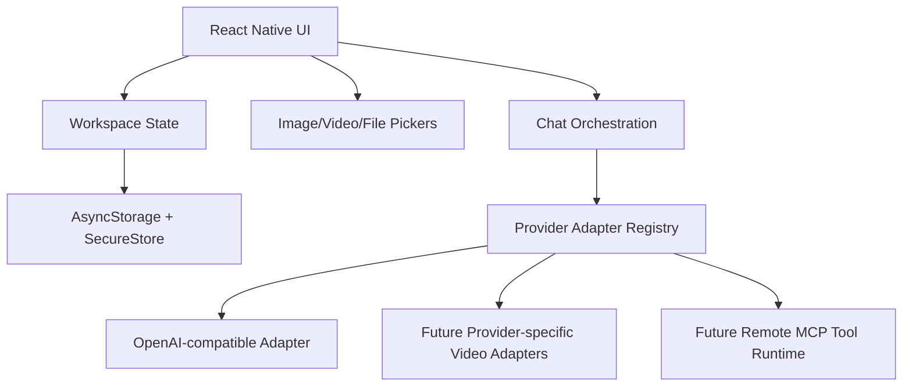

# Embezzle Studio Product and Architecture

## Product Intent

Embezzle Studio is a personal Android AI client for people who already own multiple model provider accounts, relay services, and MCP tools. The app should feel like a practical mobile merge of Cherry Studio and Doubao: fast conversation entry, easy provider switching, good multimodal handling, and explicit model capability awareness.

## Core Principles

- Provider first: every model belongs to a provider profile with its own base URL, API key, and adapter type.
- Capability aware: text, image input, video input, tool calling, streaming, and MCP are tracked explicitly instead of guessed from model names.
- OpenAI-compatible by default: Volcengine Ark, Bailian compatible mode, New API, One API, and self-hosted relays can share one adapter when they expose `/models` and `/chat/completions`.
- Discovery is provider-specific: OpenAI-compatible providers use `GET /models` first, including Volcengine Ark/Doubao. Remote discovery populates provider-scoped model candidates; users explicitly add candidates to the local model list before using them in chat. Ark keeps Doubao presets only as fallback candidates when the remote model-list request fails.
- Provider-specific when needed: Doubao video input and other non-standard media flows should be adapter modules, not conditionals scattered across the UI.
- Secrets stay local: API keys are stored through SecureStore when available and never committed.
- Mobile constraints are real: remote MCP transports are first-class; local stdio MCP is not part of the first mobile milestone because Android process and binary management would make the first version brittle.

## MVP Scope

1. Provider management
   - Built-in presets for Volcengine Ark, Alibaba Bailian compatible mode, New API relay, and custom OpenAI-compatible services.
   - User-editable provider name, base URL, API key, and active model.
   - Remote model discovery through `GET /models`.
   - Candidate model list with explicit add-to-provider action.
   - Manual provider and model entry for relays that disable model-list APIs.
   - Chat-time model switching among added models.
   - Volcengine Ark `/models` discovery with common Doubao preset fallback candidates.

2. Chat
   - Single-session chat surface.
   - Text messages through Chat Completions.
   - Image attachments converted to data URLs for models marked with image input.
   - Video attachments represented in state and UI, blocked in the generic adapter until a provider-specific uploader exists.

3. Extension foundation
   - Plugin manifest contract for mobile-safe plugins.
   - Remote MCP connection shape for Streamable HTTP and SSE transports.
   - Tool permissions modeled before execution is implemented.

## Architecture

## Provider Adapter Boundaries

The initial adapter supports common OpenAI-compatible APIs:

- `GET {baseUrl}/models`
- `POST {baseUrl}/chat/completions`
- bearer token authentication
- plain text messages
- image input through `image_url` data URLs

Provider-specific adapters should be added when the protocol diverges:

- upload-before-chat media APIs
- video frame or video file references
- non-OpenAI tool-call schemas
- provider-specific streaming event formats

## MCP Strategy

Mobile MCP starts with remote MCP only:

- `streamable-http`
- `sse`

Local stdio MCP is deferred. It requires packaging executables, sandboxing them, managing background processes, and handling Android filesystem/runtime differences. That can be revisited after the core chat app is stable.

## Data Model

- `ProviderProfile`: provider identity, adapter kind, base URL, capabilities, model list, and in-memory API key.
- `ModelInfo`: model ID plus capability hints.
- `ChatMessage`: role, content, status, attachments, and error information.
- `MediaAttachment`: local URI, MIME type, size, optional base64 image payload.
- `PluginManifest`: mobile-safe plugin or remote MCP entry.

## Security Notes

- API keys are saved through SecureStore when available.
- Web debugging falls back to AsyncStorage because SecureStore is Android/iOS-only.
- Chat history does not currently encrypt message content; local encrypted history is a later milestone.
- No key export/sync is included in the first milestone.
