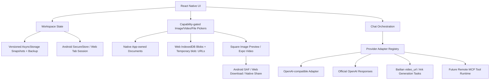

# Embezzle Studio Product and Architecture

## Product Intent

Embezzle Studio is a personal Android AI client for people who already own multiple model provider accounts, relay services, and MCP tools. The app should feel like a practical mobile merge of Cherry Studio and Doubao: fast conversation entry, easy provider switching, good multimodal handling, and explicit model capability awareness.

## Core Principles

- Provider first: every model belongs to a provider profile with its own base URL, API key, and adapter type.
- Capability aware: provider metadata and maintained model tables provide defaults; users can explicitly override model task and multimodal/reasoning/tool capabilities when inference is wrong.
- OpenAI-compatible by default: Volcengine Ark, Bailian compatible mode, New API, One API, and self-hosted relays can share one adapter when they expose `/models` and `/chat/completions`.
- Discovery is provider-specific: OpenAI-compatible providers may use `GET /models`; Volcengine Ark may best-effort probe the undocumented compatibility response only on an exact official data-plane host, then falls back to curated candidates maintained from the official public catalog. Ark account-specific Endpoint IDs remain manual unless a trusted backend later implements AK/HMAC control-plane discovery.
- Provider-specific when needed: Doubao video input and other non-standard media flows should be adapter modules, not conditionals scattered across the UI.
- Secrets stay local and platform-scoped: Android requires SecureStore and fails closed if it is unavailable; Web keeps API keys only in the current tab's `sessionStorage` (or memory as a fail-safe), removes legacy persistent values, and never includes keys in workspace snapshots.
- Mobile constraints are real: remote MCP transports are first-class; local stdio MCP is not part of the first mobile milestone because Android process and binary management would make the first version brittle.
- Native runtime UX is part of correctness: the Android IME must resize/avoid the composer, media controls must remain reachable inside narrow message cards, and navigation must avoid repeatedly rebuilding expensive chat, player, animation, or model-list subtrees.
- Web development needs a local proxy: Expo Web runs in a browser and would otherwise hit CORS on provider APIs. Android builds call providers directly.

## MVP Scope

1. Provider management
   - Built-in presets for Volcengine Ark, Alibaba Bailian compatible mode, New API relay, and custom OpenAI-compatible services.
   - User-editable provider name, base URL, API key, and active model.
   - Remote model discovery through `GET /models` where the provider documents it.
   - Candidate model list with explicit add-to-provider action.
   - Manual provider and model entry for relays that disable model-list APIs.
   - Chat-time model switching among added models.
   - Volcengine Ark compatibility-probe results with shutdown/unsupported tasks filtered, plus curated catalog fallback candidates; account Endpoint IDs can be added manually.

2. Chat
   - Persistent multi-conversation chat surface with search, branching edits/regeneration, stop, copy, share, rename, pin, and deletion flows.
   - Text messages through Chat Completions, with official OpenAI Responses-only Pro models routed to the Responses API.
   - Capability-gated image, video, and file pickers. Image bytes are materialized as data URLs only when a request needs them.
   - Square pending-image previews resolved from the durable attachment URI, plus inline native video playback/fullscreen and explicit Save/Share controls inside conversation cards.
   - Android keyboard resize/avoidance for the main composer and rename dialog. Chat remains mounted across Settings navigation, while Android uses lighter press/screen/message rendering and bounded model-candidate batches.
   - Bailian `video_url` request support, including local video selection with a pre-Base64 source bound and a 10 MiB encoded Data URL limit; other chat-video providers remain rejected until their protocols are implemented.
   - Official OpenAI file input for models explicitly marked with `file-input`; compatible relays are rejected rather than assumed to implement the same wire format.

3. Extension foundation
   - Plugin manifest contract for mobile-safe plugins.
   - Remote MCP connection shape for Streamable HTTP and SSE transports.
   - Tool permissions modeled before execution is implemented.

## Architecture

## Provider Adapter Boundaries

The initial adapter supports common OpenAI-compatible APIs:

- `GET {baseUrl}/models`
- `POST {baseUrl}/chat/completions`
- bearer token authentication
- plain text messages
- image input through `image_url` data URLs

Protocol-specific branches currently cover:

- official OpenAI Responses-only Pro requests and official OpenAI `file`/`input_file` attachments
- Alibaba Bailian `video_url` chat content with bounded inline video materialization
- Volcengine Ark image/video generation task submission and polling

Provider-specific adapters should be added when the protocol diverges:

- upload-before-chat media APIs
- video frame or video file references
- non-OpenAI tool-call schemas
- provider-specific streaming event formats

## MCP Strategy

Mobile MCP starts with remote MCP only:

- `streamable-http`
- `sse`

Local stdio MCP is deferred. It requires packaging executables, sandboxing them, managing background processes, and handling Android filesystem/runtime differences. That can be revisited after the core chat app is stable.

## Model Capability Resolution

Model capability checks live behind module seams: `src/services/modelCapabilities.ts` resolves model tasks and capabilities, while `src/services/reasoningEfforts.ts` resolves provider/model-specific thinking levels. Callers should ask predicates such as `isVisionModel`, `isWebSearchModel`, `isToolCallingModel`, `inferModelTask`, and `getReasoningEffortOptions` instead of doing local string matching.

Discovery enriches remote model IDs through local metadata/rules. Ark treats its observed `/models` response as a non-contractual compatibility hint, validates its task/modality/status metadata against adapters the app actually implements, and falls back to a versioned curated catalog snapshot. Provider-level capabilities describe transport support and are not copied onto each model. Explicit user overrides win over inferred capabilities and survive reloads. Health checks verify availability only; they do not claim that hosted tools such as web search are implemented by the current adapter.

## Data Model

- `ProviderProfile`: provider identity, adapter kind, base URL, API key, transport capability hints, and model list.
- `ModelInfo`: model ID plus resolved capability hints and optional supported reasoning effort hints.
- `ChatMessage`: role, content, status, attachments, and error information.
- `MediaAttachment`: attachment kind, durable URI, MIME type, size/dimensions, and optional request-time Base64 payload.
- `PluginManifest`: mobile-safe plugin or remote MCP entry.

## Attachment Lifecycle and Limits

- The picker enforces at most 6 attachments, 10 MiB per image, 100 MiB per video, 20 MiB per ordinary file, 120 MiB in total, and 32 megapixels per image. Provider wire protocols may impose stricter limits; Bailian inline video is limited to a 10 MiB encoded Data URL.
- Native selections are copied into an app-owned document directory without asking the image picker to duplicate full-resolution images as Base64 in the JavaScript heap. Web selections are stored as IndexedDB Blobs under durable attachment IDs; previews resolve them to short-lived `blob:` URLs instead of persisting Base64 in the workspace JSON.
- Pending image cards use a fixed square surface and resolve the same durable URI path used by sent-message previews. Conversation video cards use `expo-video` native controls in a 16:9 viewport, with a separate non-clipped action row. Saving first makes remote/data attachments durable; Android then streams the local file in bounded chunks to a user-selected Storage Access Framework document without broad media-library permission. Web creates a download, while other native platforms use the share sheet.
- Attachment deletion is transactional with workspace persistence: committed data is removed only after a successfully saved snapshot no longer references it. Picker failures before commit are reclaimed immediately.

## Mobile UI Lifecycle and Performance

- `softwareKeyboardLayoutMode: resize` and `KeyboardAvoidingView` cover the Android window, chat composer, and rename modal. Dragging either chat or Settings can dismiss the IME. The 390×844 Web regression checks layout structure only; the Android IME behavior still requires a device.
- The chat subtree remains mounted when Settings is open so message surfaces, scroll state, and attachment display state are not reconstructed on every switch. Settings mounts lazily on first use and is then hidden/reused; video playback surfaces are disabled while Settings is active.
- Android press controls and screen/message transitions avoid the heavier Reanimated variants used on other platforms. Message entry animation is limited to the two newest messages off Android, and provider candidate lists initially render 60 matches with an explicit load-more path.
- These changes reduce known JS/UI-thread and memory pressure, but they do not prove that the reported Android freeze/crash is closed. Repeated Settings/Chat switching, player cleanup, and large native attachment sessions remain part of real-device acceptance.

## Release and Update Trust Boundary

- The Android release workflow is owner-triggered from `main`, repeats its owner/rerun gate before every signing or publication boundary, requires the version tag to equal the exact current `origin/main`, and accepts only an empty owner-authored draft. Draft inspection is isolated in a short `release_contract` job with `contents: write`; preflight and publication are constrained by the main-only `android-release` Environment, checkout credentials are not persisted, signing has no repository-token permission, and the npm/Expo/Gradle build remains read-only. It builds an unsigned APK with pinned Build Tools 36.0.0, proves the input is unsigned, signs only inside `android-release`, and requires exactly one expected production certificate. Before and after publishing the draft as the latest GitHub Immutable Release, it rechecks the resolved tag/main commit plus the exact asset set, GitHub digests, states, and uploaders.
- The Pages stager accepts only an owner-published immutable Release and exact assets uploaded by `github-actions[bot]` in the uploaded state with GitHub SHA-256 digests. It then independently checks safe asset API URLs, recomputes the checksum asset and APK digests, binds the checksum to `Embezzle-Studio-${tag}-release.apk`, enforces 256 MiB/64 KiB declared and streamed limits, and creates `release.html` only after every byte-level check succeeds.
- A valid manifest points `releaseUrl` to the generated Pages `release.html` and its APK URL to the Pages `downloads/` path. A missing, mutable, non-owner, incorrectly uploaded, incomplete, or metadata-untrusted Release removes managed download output and writes a fail-closed manifest with `apk: null`; byte/digest/checksum disagreement or a configured size-limit violation aborts staging. The page states that Immutable Release, GitHub asset digest, and checksum verification still do not replace production-certificate verification with `apksigner`.
- The client fetches only the fixed public Pages manifest and accepts release/asset URLs only on this repository's exact GitHub or Pages paths. It reports an update only when a trusted install asset is present and its version is newer, displays the digest, and opens the trusted release page; it does not claim to verify or install the APK locally. Release names, notes, and publication timestamps become public Pages content and must be reviewed for disclosure before the draft is created.
- The `v1.0.4` deployment is the first production-signed immutable Release that exercised this trust boundary end to end. Its release attestation and all three local assets passed `gh release verify` / `verify-asset`, and the Pages-staged APK matched the Release APK byte-for-byte; real-device acceptance remains separate.
- The current working tree is a local `1.0.5` / Android versionCode 5 candidate containing the mobile runtime fixes above. It has no `v1.0.5` tag, Draft, workflow publication, or GitHub Release; public Latest remains production `v1.0.4`.

## Current Verification Boundary

- Local automation passes for the candidate: `npm.cmd run check` reports 15 test files / 249 tests with zero TypeScript or ESLint errors; Web export reports 3131 modules and a 6.9 MB main bundle; Expo Doctor is 20/20 and `expo install --check` passes.
- A 390×844 browser run covered Chat and Settings, an actual uploaded image rendered as a square pending preview, and 20 consecutive Settings/Chat switches. It produced no console errors; the remaining output was limited to React Native Web deprecation warnings for `shadow*` and `pointerEvents`.
- Clean Expo prebuild and unsigned `assembleRelease` pass. A local acceptance candidate was then signed with the same production certificate as `v1.0.4`: `D:\EmbezzleStudio-Releases\v1.0.5-candidate\Embezzle-Studio-v1.0.5-candidate-release.apk`, 96,473,241 bytes, SHA-256 `c390a116a592773f23626ac6b63ace40a881e710e61318eedd196c6c0d6b8bc7`. `aapt` reports package `com.szdtzpj.embezzlestudio`, version `1.0.5`/code 5, minSdk 24, and targetSdk 36. The signer fingerprint is the expected production SHA-256 `F5746B0DC5BD3F6E640F693FDE171BD0CD87A919998CD6CA3F8F26748ABE6C02`; v2/v3 verification and zipalign pass. Overlay, camera, and microphone permissions are absent. `ACCESS_NETWORK_STATE` and `WAKE_LOCK` are new transitive permissions from the native video playback dependency.
- No Android device is connected. Keyboard avoidance, native `expo-video` playback/fullscreen, Seedance remote-media behavior, Storage Access Framework saving/cancellation, and repeated page-switch stability are therefore implemented but not device-verified.
- The production-signed candidate is a local acceptance artifact only. It has not passed through the protected GitHub workflow, has no tag or Release, and must not be treated as the published update.

## Security Notes

- Android API keys are saved through SecureStore; inability to use secure storage is a hard failure rather than a plaintext fallback.
- Web API keys are scoped to the current tab session through `sessionStorage`/memory. Legacy Web keys are removed from AsyncStorage during migration, so closing the tab/session requires entering them again.
- Workspace and chat snapshots remain in AsyncStorage, but provider `apiKey` fields are stripped before serialization.
- Chat history does not currently encrypt message content; local encrypted history is a later milestone.
- No key export/sync is included in the first milestone.
