# Embezzle Studio Product and Architecture

## Product Intent

Embezzle Studio is a personal Android AI client for people who already own multiple model provider accounts, relay services, and MCP tools. The app should feel like a practical mobile merge of Cherry Studio and Doubao: fast conversation entry, easy provider switching, good multimodal handling, and explicit model capability awareness.

## Core Principles

- Provider first: every model belongs to a provider profile with its own base URL, API key, and adapter type.
- Capability aware: provider metadata and maintained model tables provide defaults; users can explicitly override model task and multimodal/reasoning/tool capabilities when inference is wrong.
- OpenAI-compatible by default: Volcengine Ark, Bailian compatible mode, New API, One API, and self-hosted relays can share one adapter when they expose `/models` and `/chat/completions`.
- Discovery is provider-specific: OpenAI-compatible providers may use `GET /models`; Volcengine Ark may best-effort probe the undocumented compatibility response only on an exact official data-plane host, then falls back to curated candidates maintained from the official public catalog. Ark account-specific Endpoint IDs remain manual unless a trusted backend later implements AK/HMAC control-plane discovery.
- Provider-specific when needed: Doubao video input and other non-standard media flows should be adapter modules, not conditionals scattered across the UI.
- Secrets stay local and platform-scoped: Android requires SecureStore and fails closed if it is unavailable; Web keeps structured API-key fields only in the current tab's `sessionStorage` (or memory as a fail-safe), removes legacy persistent values, and excludes those structured fields from workspace snapshots. Ordinary conversation, prompt, template, note, and error text is preserved as authored and is not secret-scanned, so credentials must not be pasted into those fields.
- Mobile constraints are real: remote MCP transports are first-class; local stdio MCP is not part of the first mobile milestone because Android process and binary management would make the first version brittle.
- Native runtime UX is part of correctness: the Android IME must resize/avoid the composer, media controls must remain reachable inside narrow message cards, and navigation must avoid repeatedly rebuilding expensive chat, player, animation, or model-list subtrees.
- Web development needs a local proxy: Expo Web runs in a browser and would otherwise hit CORS on provider APIs. Android builds call providers directly.
- Zero owned service cost: Embezzle Studio does not supply or subsidize model/search/voice/media capacity and operates no production API, proxy, tool gateway, exchange-rate service, telemetry backend, sync backend, or background worker. Provider-backed features activate only with a user-owned credential and an implemented exact protocol; all provider charges stay with that user's account.

## MVP Scope

1. Provider management
   - Built-in presets for Volcengine Ark, Alibaba Bailian compatible mode, New API relay, and custom OpenAI-compatible services.
   - User-editable provider name, base URL, API key, and active model.
   - Remote model discovery through `GET /models` where the provider documents it.
   - Candidate model list with explicit add-to-provider action.
   - Manual provider and model entry for relays that disable model-list APIs.
   - Chat-time model switching among added models.
   - Volcengine Ark compatibility-probe results with shutdown/unsupported tasks filtered, plus curated catalog fallback candidates; account Endpoint IDs can be added manually.

2. Chat
   - Persistent multi-conversation chat surface with search, branching edits/regeneration, stop, copy, share, rename, pin, and deletion flows.
   - Text messages through Chat Completions, with official OpenAI Responses-only Pro models routed to the Responses API.
   - Capability-gated image, video, and file pickers. Image bytes are materialized as data URLs only when a request needs them.
   - Square pending-image previews resolved from the durable attachment URI, plus inline native video playback/fullscreen and explicit Save/Share controls inside conversation cards.
   - Android keyboard resize/avoidance for the main composer and rename dialog. Chat remains mounted across Settings navigation, while Android uses lighter press/screen/message rendering and bounded model-candidate batches.
   - Bailian `video_url` request support, including local video selection with a pre-Base64 source bound and a 10 MiB encoded Data URL limit; other chat-video providers remain rejected until their protocols are implemented.
   - Official OpenAI file input for models explicitly marked with `file-input`; compatible relays are rejected rather than assumed to implement the same wire format.

3. Extension foundation
   - Plugin manifest contract for mobile-safe plugins.
   - Remote MCP connection shape for Streamable HTTP and SSE transports, with public-HTTPS endpoint validation and separately stored authorization.
   - An official OpenAI provider-hosted Responses MCP runtime with an exact allowlist, per-call full-argument approval, bounded serial execution, and actual provider-request accounting.

4. Local workspace and cost safety
   - Local projects with project instructions, default models, conversation membership, and explicit migration when a project is deleted.
   - Conversation branching with regenerated message/comparison IDs and canonical origin IDs for analytics/task deduplication.
   - Bounded literal global search across projects, templates, conversations, and messages; provider, key, plugin, and usage-ledger data are excluded.
   - A provider setup wizard that treats kind/endpoint/key as one binding and clears old secrets/models before a changed destination is queried.
   - A capability matrix that separates provider-declared metadata from client-tested serializer/parser support.
   - A local cost guard with output-token/request/comparison limits, next-attempt gating after completed known CNY/USD subtotals reach configured thresholds, multi-charge confirmation, and an attempt ledger that preserves unknown costs.

## Architecture

```mermaid
flowchart TD
    UI["React Native UI"] --> Workspace["Workspace State"]
    Workspace --> Projects["Local Projects + Conversation Branches"]
    Workspace --> LocalSearch["Bounded Local Search"]
    Workspace --> CostGuard["Local Cost Guard + Attempt Ledger"]
    Workspace --> Snapshots["Versioned AsyncStorage Snapshots + Backup"]
    Workspace --> Secrets["Android SecureStore / Web Tab Session"]
    UI --> Media["Capability-gated Image/Video/File Pickers"]
    Media --> NativeMedia["Native App-owned Documents"]
    Media --> WebMedia["Web IndexedDB Blobs + Temporary blob: URLs"]
    Media --> Preview["Square Image Preview / Expo Video"]
    Preview --> Export["Android SAF / Web Download / Native Share"]
    UI --> ChatEngine["Chat Orchestration"]
    ChatEngine --> ProviderAdapter["Provider Adapter Registry"]
    ProviderAdapter --> Setup["Endpoint/Key Binding + Capability Evidence"]
    ProviderAdapter --> OpenAI["OpenAI-compatible Adapter"]
    ProviderAdapter --> OpenAIResponses["Official OpenAI Responses"]
    ProviderAdapter --> ProviderMedia["Bailian video_url / Ark Generation Tasks"]
    ProviderAdapter --> MCP["Safe OpenAI Responses MCP Runtime"]
```

## Provider Adapter Boundaries

The initial adapter supports common OpenAI-compatible APIs:

- `GET {baseUrl}/models`
- `POST {baseUrl}/chat/completions`
- bearer token authentication
- plain text messages
- image input through `image_url` data URLs

Protocol-specific branches currently cover:

- official OpenAI Responses-only Pro requests and official OpenAI `file`/`input_file` attachments
- official `api.openai.com` provider-hosted Responses MCP with local per-call approval
- Alibaba Bailian `video_url` chat content with bounded inline video materialization
- Volcengine Ark image/video generation task submission and polling

Provider-specific adapters should be added when the protocol diverges:

- upload-before-chat media APIs
- video frame or video file references
- non-OpenAI tool-call schemas
- provider-specific streaming event formats

## MCP Strategy

Mobile MCP is remote and BYOK only. Embezzle Studio does not run a production API, MCP gateway, approval server, or tool worker; the user's selected model provider connects to the user's public remote MCP server. Supported configuration transports are:

- `streamable-http`
- `sse`

The executable v1.4 path is limited to the dedicated `openai-compatible` kind inspected as the exact canonical `https://api.openai.com/v1` Responses adapter. It sends `require_approval: "always"`, a non-empty exact `allowed_tools` list, `store: false`, `parallel_tool_calls: false`, and `include: ["reasoning.encrypted_content"]`; provider requests and the local development proxy both reject redirects. Stateless continuations manually accumulate the original input, every prior output item, and every approval response, while rejecting missing encrypted reasoning state, ambiguous list-tools errors, and response/approval/call ID replay across rounds. Each tool call pauses on-device to show its full JSON arguments and accepts only approve, deny, or cancel; there is no remembered or blanket approval, and a turn stops after at most four approvals. Every initial and continuation Response is conservatively registered before send as a potentially billable request attempt; it is not proof of provider receipt or a provider bill. Provider-hosted web search and multi-model comparison are mutually exclusive with MCP in this first runtime.

Ark documents approval request/response items, but its runtime remains disabled until a real account proves that a complete `store: false` local replay can continue without provider-side response storage. Bailian Responses does not expose an equivalent pre-execution approval pause and remains non-executing. Provider and MCP credentials stay in platform-scoped secret storage and are excluded from backups and diagnostic logs. The implementation does not claim real-account or Android acceptance until the external matrix is completed; see [v1.4 Safe MCP Tools](./safe-mcp-tools.md).

Local stdio MCP remains deferred. It would require packaging executables, sandboxing them, managing background processes, and handling Android filesystem/runtime differences.

## Model Capability Resolution

Model capability checks live behind module seams: `src/services/modelCapabilities.ts` resolves model tasks and capabilities, while `src/services/reasoningEfforts.ts` resolves provider/model-specific thinking levels. Callers should ask predicates such as `isVisionModel`, `isWebSearchModel`, `isToolCallingModel`, `inferModelTask`, and `getReasoningEffortOptions` instead of doing local string matching.

Discovery enriches remote model IDs through local metadata/rules. Ark treats its observed `/models` response as a non-contractual compatibility hint, validates its task/modality/status metadata against adapters the app actually implements, and falls back to a versioned curated catalog snapshot. Provider-level capabilities describe transport support and are not copied onto each model. Explicit user overrides win over inferred capabilities and survive reloads. Health checks verify availability only; they do not claim that hosted tools such as web search are implemented by the current adapter. The `1.2.0` capability matrix keeps provider/model declarations separate from client-supported routes, so UI evidence never creates protocol support by implication.

Provider setup uses a separate draft and a canonical endpoint fingerprint. A saved kind or endpoint change clears the old key, models, and discovery candidates before any request can target the new destination. Known Bailian Coding Plan/Token Plan endpoints and `sk-sp-` subscription keys are rejected for this custom application instead of being treated as pay-as-you-go credentials.

## Data Model

- `ProviderProfile`: provider identity, adapter kind, base URL, API key, transport capability hints, and model list.
- `ModelInfo`: model ID plus resolved capability hints and optional supported reasoning effort hints.
- `WorkspaceProject`: local project identity, optional instruction and default model; conversations point to a project rather than requiring a sync service.
- `ChatConversation`: conversation metadata, optional parent/branch-point lineage, and the explicit IDs of project reference sources selected for request context.
- `ChatMessage`: role, content, status, attachments, citations, comparison selection, request metrics, usage, error information, optional canonical `originMessageId` for branch deduplication, and local context exclusion/pinning flags.
- `WorkspaceArtifact` and `WorkspaceArtifactRevision`: project-scoped inert text outcomes with bounded append-only revision history, active-revision identity, format/language metadata, and optional source message/conversation lineage.
- `ProjectKnowledgeSource`: project-scoped local reference text authored manually, captured from a message/artifact snapshot, or imported from an allowed plain-text/code file.
- `MediaAttachment`: attachment kind, durable URI, MIME type, size/dimensions, and optional request-time Base64 payload.
- `PluginManifest`: mobile-safe plugin or remote MCP entry.
- `PromptTemplate`, `ModelPricing`, `ModelTargetRef`, `WebSearchSettings`, and `VoiceSettings`: local productivity configuration without copied provider secrets.
- `CostGuardSettings`: local output-token, comparison, request, completed-known-cost, unknown-cost, and multi-charge confirmation policy.
- `ProviderUsageEvent`: device-local request-attempt status and known/unknown cost components. It is not provider billing data and is excluded from exported backups.

## Attachment Lifecycle and Limits

- The picker enforces at most 6 attachments, 10 MiB per image, 100 MiB per video, 20 MiB per ordinary file, 120 MiB in total, and 32 megapixels per image. Provider wire protocols may impose stricter limits; Bailian inline video is limited to a 10 MiB encoded Data URL.
- Native selections are copied into an app-owned document directory without asking the image picker to duplicate full-resolution images as Base64 in the JavaScript heap. Web selections are stored as IndexedDB Blobs under durable attachment IDs; previews resolve them to short-lived `blob:` URLs instead of persisting Base64 in the workspace JSON.
- Pending image cards use a fixed square surface and resolve the same durable URI path used by sent-message previews. Conversation video cards use `expo-video` native controls in a 16:9 viewport, with a separate non-clipped action row. Saving first makes remote/data attachments durable; Android then streams the local file in bounded chunks to a user-selected Storage Access Framework document without broad media-library permission. Web creates a download, while other native platforms use the share sheet.
- Attachment deletion is transactional with workspace persistence: committed data is removed only after a successfully saved snapshot no longer references it. Picker failures before commit are reclaimed immediately.

## Mobile UI Lifecycle and Performance

- `softwareKeyboardLayoutMode: resize` and `KeyboardAvoidingView` cover the Android window, chat composer, and rename modal. Dragging either chat or Settings can dismiss the IME. The user has confirmed the main IME path on one Android phone. The model-picker `Modal` independently consumes `useSafeAreaInsets().bottom`, while its list can shrink and scroll, so content does not intentionally occupy the Android navigation-control inset; this new system-bar path and additional device/keyboard combinations still require acceptance.
- The chat subtree remains mounted when Settings is open so message surfaces, scroll state, and attachment display state are not reconstructed on every switch. Settings mounts lazily on first use and is then hidden/reused; video playback surfaces are disabled while Settings is active.
- Android press controls and screen/message transitions avoid the heavier Reanimated variants used on other platforms. Message entry animation is limited to the two newest messages off Android, provider candidate lists initially render 60 matches with an explicit load-more path, and the pending-response indicator uses one UI-thread folding glyph with explicit animation cleanup instead of three independent looping dots.
- The app icon, adaptive foreground/background, Android 13 monochrome icon, favicon, and explicit native splash screen are derived from the same double-ribbon S mark. The splash background matches the app background canvas (`#F4F4F4`) to avoid an intentional white-template flash.
- The user confirmed that the originally reported Settings/Chat freeze path is resolved on their phone and later authorized `v1.0.6` publication. That authorization is not a connected-device test log for the final Actions APK; additional-device and sustained stress coverage, player cleanup under failure, large native attachment sessions, system-bar variants, launcher masks, splash rendering, and native-animation profiling remain independent real-device work.

## BYOK Productivity and Tool Boundary

- Multi-model comparison performs complete preflight before any of 2–4 independent calls, shares one group `AbortController`, records per-candidate timing/usage, and passes only the selected successful candidate into later context.
- Projects, project instructions/default models, conversation membership, conversation branches, and global search are local-only. Branch cloning regenerates message/comparison IDs while preserving canonical origin IDs; usage analytics and the media task center deduplicate inherited history. Global search is bounded and excludes provider/key/plugin/ledger data.
- Provider onboarding treats provider kind, canonical endpoint, and key as one security binding. A changed binding clears old credentials/models before discovery. Bailian subscription-plan endpoints that are not permitted for custom applications are blocked, and the capability matrix separates declared metadata from adapters actually implemented by the client.
- Search uses exact official Responses endpoints for OpenAI, Ark, and Bailian. Capability inference, adapter support, user credential readiness, and response evidence are separate checks. Citations are structured, visible, clickable, and restricted to safe HTTPS URLs.
- Android request-based audio supports official OpenAI and Bailian only. Recording is foreground-only and transcribed text is never auto-sent. Synthesized speech is cached before playback. Volcengine speech remains disabled until a separate speech credential profile exists; OpenAI Realtime remains disabled because safe ephemeral tokens require a broker.
- The task center is a projection of durable conversation messages; it has no duplicate cloud job database and performs no background polling. The usage dashboard aggregates only locally retained canonical events and treats user-entered prices as estimates, without a price or FX service.
- The local cost guard can apply an output cap before text/search calls, cap comparison targets, warn/block on unknown cost, and require confirmation for potentially multiple charges. Daily CNY/USD thresholds inspect the already completed, locally known subtotal and only gate the next attempt once that subtotal has reached the threshold; they do not project the current request or promise that a provider bill cannot cross a budget. Currencies are never converted, unknown cost is never zero, and the attempt ledger is not a true provider bill.
- External backups are authenticated encrypted files, but secrets, media, `providerUsageEvents`, and local MCP activity summaries are removed before encryption. Internal workspace schema v6 migrates v5/v4/v3/v2, stores provider/MCP secrets separately, preserves the current device's attempt ledger on import, and strictly normalizes projects, branches, artifacts, project reference sources, MCP activity metadata, and cost settings. Backup import always restores every remote MCP entry as disabled; internal loading also disables any entry not bound to the exact official OpenAI provider kind and canonical endpoint.
- MCP configuration permits only remote HTTPS endpoints, rejects embedded credentials/query strings/private destinations, stores authorization separately, defaults disabled, and displays a permission confirmation. The exact official OpenAI Responses adapter now implements non-empty allowlists, per-call full-argument approval, cumulative `store: false` continuation, serial tool calls, a four-approval cap, approve/deny/cancel, and conservative pre-send request-attempt counting. `store: false` does not override provider security logs, organization data controls, or the remote server's retention policy. Ark and Bailian execution remain disabled for the protocol reasons above, and real OpenAI/MCP-server Android acceptance remains an external release boundary.

The full matrix and official contracts are recorded in [BYOK Productivity Suite](./byok-productivity-suite.md).

## Local Knowledge and Artifact Boundary

- Artifacts and project reference sources live in the versioned local workspace. Artifact edits append bounded revisions; restoring an old version creates a new revision rather than deleting later history. Line diffs are bounded, and export operates on the active text revision. Artifact-revision text and project-source text each have a 2,000,000 UTF-8-byte aggregate budget in addition to per-record limits.
- Artifact formats are display/export metadata. Markdown, JSON, HTML, and code remain inert strings inside the client; HTML exports as `.html.txt`/`text/plain`, and the client does not evaluate it, start a WebView preview, invoke a runtime, or grant network/tool access.
- Project-source import accepts only an explicit allowlist of plain-text/code file extensions and MIME types, with byte and character limits. PDF, Office, OpenDocument, media, archive, APK, and executable parsing is deliberately unsupported.
- Project search builds a bounded device-local text/chunk index and uses literal/token matching. It has no embeddings, vector database, remote retrieval service, semantic-RAG claim, or automatic-memory claim.
- A source enters a provider request only when its ID is explicitly selected for that conversation. Selected text is bounded and composed as a separate local-knowledge system record; source data never gains higher authority merely because it was imported. Arbitrary prompt-injection text cannot be perfectly detected, so selection and context inspection remain user-visible.
- For chat requests, the context inspector uses the same local transcript composer as requests and reports conservative text-token estimates, included/excluded/trimmed/pinned message IDs, included/omitted/missing knowledge, and attachment uncertainty. Comparison targets share the same smallest-window transcript. Required text over 90% of a declared model window is blocked before cost authorization; attachment tokens remain explicitly unknown.
- Image/video adapters receive only the newest prompt, so context inspection and compression are unavailable for those task types. Compression creates a composer draft only; a model call occurs only after a later explicit chat send through the normal user-owned provider and cost guard.
- Main chat, context messages, and knowledge selectors render bounded initial windows/pages. Knowledge indexing is delayed until a non-empty query; selected-context construction ignores unselected source bodies and caches its result per immutable workspace snapshot.
- These local capabilities require no Embezzle Studio API, server, worker, cloud sync, telemetry, vector store, or app-owned quota. If selected context is sent to a model, the user's configured provider endpoint, key, entitlement, quota, and billing remain authoritative.

The full `1.3.0` contract and unsupported-format list are recorded in [Local Knowledge and Artifact Workbench](./local-knowledge-workbench.md).

## Release and Update Trust Boundary

- The Android release workflow is owner-triggered from `main`, repeats its owner/rerun gate before every signing or publication boundary, requires the version tag to equal the exact current `origin/main`, and accepts only an empty owner-authored draft. Draft inspection is isolated in a short `release_contract` job with `contents: write`; preflight and publication are constrained by the main-only `android-release` Environment, checkout credentials are not persisted, signing has no repository-token permission, and the npm/Expo/Gradle build remains read-only. It builds an unsigned APK with pinned Build Tools 36.0.0, proves the input is unsigned, signs only inside `android-release`, and requires exactly one expected production certificate. Before and after publishing the draft as the latest GitHub Immutable Release, it rechecks the resolved tag/main commit plus the exact asset set, GitHub digests, states, and uploaders.
- The Pages stager accepts only an owner-published immutable Release and exact assets uploaded by `github-actions[bot]` in the uploaded state with GitHub SHA-256 digests. It then independently checks safe asset API URLs, recomputes the checksum asset and APK digests, binds the checksum to `Embezzle-Studio-${tag}-release.apk`, enforces 256 MiB/64 KiB declared and streamed limits, and creates `release.html` only after every byte-level check succeeds.
- A valid manifest points `releaseUrl` to the generated Pages `release.html` and its APK URL to the Pages `downloads/` path. A missing, mutable, non-owner, incorrectly uploaded, incomplete, or metadata-untrusted Release removes managed download output and writes a fail-closed manifest with `apk: null`; byte/digest/checksum disagreement or a configured size-limit violation aborts staging. The page states that Immutable Release, GitHub asset digest, and checksum verification still do not replace production-certificate verification with `apksigner`.
- The client fetches only the fixed public Pages manifest and accepts release/asset URLs only on this repository's exact GitHub or Pages paths. It reports an update only when a trusted install asset is present and its version is newer, displays the digest, and opens the trusted release page; it does not claim to verify or install the APK locally. Release names, notes, and publication timestamps become public Pages content and must be reviewed for disclosure before the draft is created.
- The `v1.0.4` deployment is the first production-signed immutable Release that exercised this trust boundary end to end. Its release attestation and all three local assets passed `gh release verify` / `verify-asset`, and the Pages-staged APK matched the Release APK byte-for-byte; real-device acceptance remains separate.
- Stable [`v1.3.0`](https://github.com/szdtzpj/Embezzle-Studio/releases/tag/v1.3.0) is the current immutable, non-prerelease Latest Release with exactly 3 assets. Previous stable `v1.0.6` remains historical evidence: PR #10 merged as exact release commit `888db913c154fc60fdc7fa4b9de947be55ab10c0`, Android run `29092367202` passed its protected build/sign/publish contract, and Pages run `29094337390` staged its verified APK bytes.

## Current Verification Boundary

- Local development metadata is `1.4.0` / code 10; it has not been pushed, tagged, uploaded, or released. Public stable metadata remains `1.3.0` / code 9: PR #13 merged as `ea9409f1ea3540520eaf469a0c777fe1bc87e7f8`, and tag `v1.3.0` points exactly to that commit.
- The complete local `1.4.0` gate passes 41 test files / 749 tests with clean TypeScript and ESLint; Web export reports 3,264 modules / 7.4 MB, Expo Doctor is 20/20, and the workflow/YAML/Bash/Action-SHA/diff/secret gates pass. A 390×844 locally intercepted browser fixture exercises MCP approve, deny, and cancel, repeats approve after a clean final-code reload, verifies the exact stateless request controls, and records zero console errors plus only loopback proxy requests.
- Clean prebuild, unsigned Release assembly, local production signing, aapt/apksigner, and zipalign pass for `D:\EmbezzleStudio-Releases\v1.4.0-candidate\Embezzle-Studio-v1.4.0-candidate-release.apk`, 97,518,039 bytes, SHA-256 `683eb6e98efec3e301594e59c627b3698b410c2a58f841b3c3c3642b1a2a20ed`. It identifies as `com.szdtzpj.embezzlestudio` 1.4.0/code 10, min/target 24/36, `allowBackup=false`, intentional `RECORD_AUDIO`, no CAMERA/overlay, one expected production signer, v2/v3, and valid alignment. See the [v1.4 checkpoint](./CONTINUATION_CHECKPOINT_2026-07-12_V1.4.md).
- The complete `1.3.0` local gate passes: `npm.cmd run check` reports 38 test files / 634 tests with clean TypeScript and ESLint; Web export reports 3,259 modules / 7.4 MB. A fresh 390×844 exported-Web session verifies inert HTML `.html.txt` export/content, artifact version history, artifact-to-knowledge capture, bounded local search, explicit source selection changing the actual count from 0 to 1, and context compression producing a draft without sending. It records 0 console errors, 0 warnings, and no non-static requests.
- `expo install --check`, Expo Doctor 20/20, all 3 workflow YAML files, all 35 Bash blocks under `bash -n`, all 16 official Actions at full SHAs, and diff/secret-boundary checks pass. Final audit regressions include conservative Unicode/emoji token gating, 200/201/256-character entity-ID and Unicode-code-point round trips, fail-closed aggregate storage budgets, bounded backup sizing, provider-endpoint secret rejection, and atomic backup import.
- Clean prebuild and `clean assembleRelease` pass. The production-signed local candidate is `D:\EmbezzleStudio-Releases\v1.3.0-candidate\Embezzle-Studio-v1.3.0-candidate-release.apk`, 97,448,407 bytes, SHA-256 `c95dafe6e6eb77f3a1a4c7504c6ad05c27218b45972de2e247db264ec4c777d4`. It identifies as `com.szdtzpj.embezzlestudio` version `1.3.0`/code 9 with minSdk 24, targetSdk 36, `allowBackup=false`, intentional `RECORD_AUDIO`, and no CAMERA or `SYSTEM_ALERT_WINDOW`. Exactly one expected production signer is present with certificate SHA-256 `F5746B0DC5BD3F6E640F693FDE171BD0CD87A919998CD6CA3F8F26748ABE6C02`; v2/v3 and zipalign pass.
- PR Quality run `29176034579`, `main` Quality run `29176125303`, initial Pages run `29176125307`, production Android run `29176245049`, and post-release Pages run `29176763721` all succeeded. The formal Release is Latest, immutable, non-prerelease, and contains exactly 3 assets; its Release attestation and all 3 asset attestations pass.
- The formal `Embezzle-Studio-v1.3.0-release.apk` is 97,448,407 bytes with SHA-256 `b5e48387e62d99512ae18a2c4f4a80ddf482c3c1b489768e924845e0adceb7fe`. It is distinct from the same-size local candidate with SHA-256 `c95dafe6e6eb77f3a1a4c7504c6ad05c27218b45972de2e247db264ec4c777d4`. The formal APK independently identifies as `com.szdtzpj.embezzlestudio` version `1.3.0`/code 9, minSdk 24/targetSdk 36, `allowBackup=false`, intentional `RECORD_AUDIO`, and no CAMERA or `SYSTEM_ALERT_WINDOW`; it has one signer with certificate SHA-256 `F5746B0DC5BD3F6E640F693FDE171BD0CD87A919998CD6CA3F8F26748ABE6C02`, and v2/v3 plus zipalign pass.
- Formal assets are stored under `D:\EmbezzleStudio-Releases\v1.3.0`. The post-release Pages manifest and `release.html` return anonymous HTTP 200 and match the Release exactly; a full public APK download under `D:\EmbezzleStudio-Releases\v1.3.0-pages-public-verify-20260712-103132` matches the formal size and hash.
- `adb devices -l` is still empty. No connected-device test of the local v1.4 candidate or final v1.3 Actions APK, additional-device matrix, real-provider-account behavior, or billing acceptance is claimed.
- Historical `1.2.0` evidence remains unchanged: 27 test files / 528 automated tests, zero TypeScript/ESLint errors or warnings, Web export at 3,254 modules / 7.3 MB, a clean 390×844 browser session, `expo install --check`, Expo Doctor 20/20, workflow/Bash/Action-SHA/diff checks, clean prebuild/Release assembly, and production-certificate candidate signing passed for that source tree.
- The historical `1.2.0` candidate is `D:\EmbezzleStudio-Releases\v1.2.0-candidate\Embezzle-Studio-v1.2.0-candidate-release.apk`, 97,313,239 bytes, SHA-256 `872f32a48320f2a20dadee6fc0f699668666d067a60e546a19467ed922082da0`. It identifies as version `1.2.0`/code 8 and therefore cannot validate or be relabeled as `1.3.0`.

- Historical `1.1.0` evidence remains unchanged: that source passed `npm.cmd run check` with 21 test files / 423 tests, zero TypeScript errors, and zero ESLint warnings. Its final Web export passed at 3,249 modules / 7.2 MB; Expo Doctor was 20/20 and `expo install --check` passed. A clean 390×844 exported-Web session covered the productivity settings, saved/applied a prompt template, and proved a production-style provider send failed before contacting the local proxy; browser console evidence was 0 errors / 0 warnings. All 3 workflow YAML files, 35 Bash blocks, and `git diff --check` passed.

- Historical `1.1.0` clean Android prebuild and `NODE_ENV=production` unsigned Release assembly passed. Its production-signed local candidate is `D:\EmbezzleStudio-Releases\v1.1.0-candidate\Embezzle-Studio-v1.1.0-candidate-release.apk`, 97,198,551 bytes, SHA-256 `f4a0062fc03d320bb5e3915b6b9a0cdb3a80ee16b4ad18cce78edfd79f92cd80`. `aapt` reports version `1.1.0`/code 7, minSdk 24, targetSdk 36, intentional `RECORD_AUDIO`, and no camera/overlay permission. It has one expected production signer, v2/v3, and valid zip alignment. This is not a public asset and does not validate `1.2.0`.

- Local automation passes for the `1.0.6` release source: `npm.cmd run check` reports 15 test files / 252 tests with zero TypeScript or ESLint errors/warnings; Web export reports 3137 modules and a 6.9 MB main bundle; Expo Doctor is 20/20 and `expo install --check` passes. All 3 workflow YAML files and 35 embedded Bash blocks parse successfully, and `git diff --check` passes.
- A clean 390×844 exported-Web session covered Chat, the model picker, Settings, and return navigation with zero console errors or warnings. A separate loopback proxy with a delayed fake response exercised the new folding glyph in a real browser and completed with the expected assistant text; this proves the Web animation path, not Android Reanimated rendering.
- Clean Expo prebuild and unsigned `assembleRelease` pass. A pre-publication local acceptance candidate was signed with the same production certificate as `v1.0.4`: `D:\EmbezzleStudio-Releases\v1.0.6-candidate\Embezzle-Studio-v1.0.6-candidate-release.apk`, 96,682,256 bytes, SHA-256 `51186c1b746210ce60d0c79f84751785f2927766831b4d84566e1b0191baeea0`. This candidate remains useful local evidence but is not the public asset and its bytes must not be conflated with the Actions rebuild.
- The formal GitHub assets are downloaded under `D:\EmbezzleStudio-Releases\v1.0.6`. `Embezzle-Studio-v1.0.6-release.apk` is 96,805,335 bytes with SHA-256 `1a1fa2d5dc2bac2293994a92e0e65e7033bb4006082e503125d580c778d104f9`. `aapt` reports package `com.szdtzpj.embezzlestudio`, version `1.0.6`/code 6, minSdk 24, and targetSdk 36. Its single signer has production SHA-256 `F5746B0DC5BD3F6E640F693FDE171BD0CD87A919998CD6CA3F8F26748ABE6C02`; v2/v3 verification and zipalign pass, and overlay/camera/microphone permissions are absent. Release attestation, all three `verify-asset` checks, checksum, GitHub digests/uploaders, Pages metadata, and an anonymous full APK download all match.
- The user reports that the four original `1.0.5` main paths now work on their Android phone and later authorized publication. This is user-reported device acceptance plus a release decision, not evidence produced by the local automation run for the final Actions APK.
- No Android device is connected to the current run. Independent coverage of additional devices, SAF cancellation/failure/low-space paths, remote-media expiry, system-bar variants, launcher/themed masks, splash rendering, native-animation profiling, and sustained stress remains open.

## Security Notes

- Android API keys are saved through SecureStore; inability to use secure storage is a hard failure rather than a plaintext fallback.
- Web API keys are scoped to the current tab session through `sessionStorage`/memory. Legacy Web keys are removed from AsyncStorage during migration, so closing the tab/session requires entering them again.
- Workspace and chat snapshots remain in AsyncStorage, but provider `apiKey` fields are stripped before serialization.
- Chat history in the live workspace is not encrypted at rest; encrypted export is available but is not equivalent to an encrypted live database.
- Structured provider API-key and MCP-authorization fields, media, and the device-local `providerUsageEvents` attempt ledger are excluded from export/sync, even inside an encrypted backup. Ordinary conversations, prompts, templates, notes, and error text are preserved as authored and are not secret-scanned, so users must not paste credentials into those fields. Import preserves the ledger already present on the receiving device.
- Android sets `allowBackup: false` so workspace conversations and the local attempt ledger are not eligible for Android/Google automatic app backup; cross-device migration should use the explicit authenticated encrypted export. The historical clean `1.2.0` package, local `1.3.0` candidate, and Actions-built formal `v1.3.0` APK independently verify `android:allowBackup="false"`.
- Encrypted import reuses a local provider key only when provider ID, provider kind, and canonical Base URL all match. MCP authorization additionally requires matching plugin type, transport, and canonical endpoint; a same-ID backup entry at another endpoint never inherits a secret.
